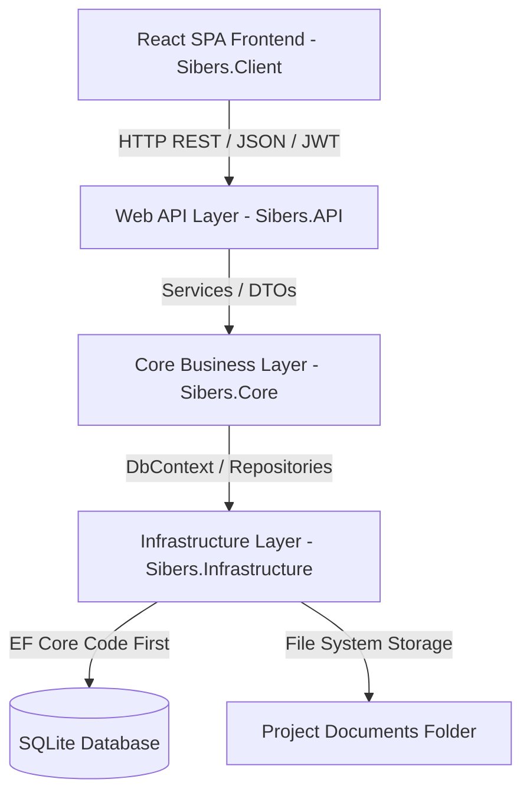
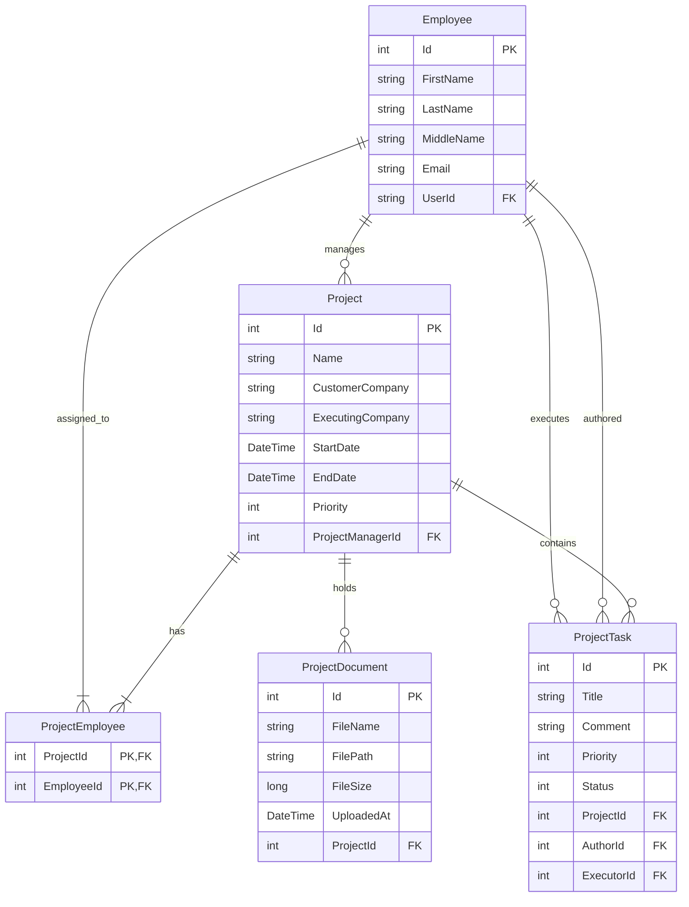

# Implementation Plan: Sibers Project & Task Management System

This document outlines the detailed architecture and implementation plan for the Sibers C# / .NET Developer test task as specified in [`Sibers/C-sharp.pdf`](Sibers/C-sharp.pdf).

---

## 1. Selected Stack & Architecture

- **Backend**: .NET 8 Web API
  - **Architecture**: Three-Tier Architecture (`Sibers.Core`, `Sibers.Infrastructure`, `Sibers.API`, `Sibers.Tests`)
  - **ORM & DB**: Entity Framework Core Code-First with SQLite database (`Microsoft.EntityFrameworkCore.Sqlite`)
  - **Auth & Identity**: ASP.NET Core Identity with JWT bearer authentication & Role-Based Access Control (`Director`, `ProjectManager`, `Employee`)
  - **Code Comments**: All comments in code strictly in English
- **Frontend**: React SPA (built with Vite / JavaScript / CSS)
  - **UI Components**: 5-step Project Creation Wizard with AJAX Employee Search & Drag-and-Drop HTML5 File Uploader
  - **Role-based UI Guards**: Custom navigation & view permissions per role
- **Testing**: xUnit + Moq / InMemory DB for Core Business Logic unit tests

---

## 2. High-Level Architecture Diagram

---

## 3. Database Schema (ERD)

---

## 4. Execution Steps

### Phase 1: Solution Setup & Domain Design
1. Restructure solution into 3 tiers + tests + frontend:
   - [`Sibers.Core`](Sibers/Sibers.csproj) - Domain entities (`Project`, `Employee`, `ProjectTask`, `ProjectDocument`), interfaces, DTOs, filter specifications.
   - `Sibers.Infrastructure` - `AppDbContext`, EF Configurations, Identity integration, Repository & FileStorage implementations.
   - `Sibers.API` - Web API controllers, Swagger, JWT Auth configuration, Global Exception Handler.
   - `Sibers.Tests` - xUnit test project for business logic.
   - `Sibers.Client` - React Vite SPA project.
2. Define domain entities, enums (`TaskStatus`: ToDo, InProgress, Done; `UserRole`: Director, ProjectManager, Employee), relationships, and Fluent API configurations.
3. Apply initial EF Core migration for SQLite database.

### Phase 2: Core Logic & Repositories
1. Implement repositories / unit of work pattern for Projects, Employees, Tasks, and Documents.
2. Implement services for:
   - Project filtering (by date range, priority range) and sorting (by name, start date, end date, priority).
   - Employee live search endpoint (search by first/last/patronymic name or email for AJAX dropdowns).
   - Task filtering (by status, assigned project) and sorting.
   - Project document upload, validation, and file persistence.
3. Configure ASP.NET Core Identity with roles (`Director`, `ProjectManager`, `Employee`) and seed initial administrator/demo users.

### Phase 3: Web API Controllers & Auth
1. `AuthController`: Register, Login, Current User profile, JWT issuing.
2. `EmployeesController`: Employee CRUD with role policy checks.
3. `ProjectsController`: Project CRUD, team management (add/remove employees), document upload, wizard endpoints, filtering & sorting.
4. `TasksController`: Task CRUD, changing status, changing executors.
5. Swagger / OpenAPI documentation with JWT Bearer scheme enabled.

### Phase 4: Unit Testing
1. Unit tests for `ProjectService`: testing filtering, priority sorting, assigning team members, validating PM eligibility.
2. Unit tests for `TaskService`: testing status transitions, executor validation (executor must be project employee).
3. Unit tests for `DocumentService`: file upload handling and project attachment.

### Phase 5: React SPA Frontend
1. Setup React + Vite SPA inside `Sibers.Client` or root `ClientApp`.
2. Implement Auth Context & Token Storage (JWT).
3. Implement 5-Step Project Wizard Component:
   - **Step 1**: Basic Details (Project Name, Start Date, End Date, Priority).
   - **Step 2**: Companies (Customer Company, Executing Company).
   - **Step 3**: Project Manager Selection (Live AJAX debounce search input with dropdown).
   - **Step 4**: Executing Employees Selection (Live AJAX debounce search input with multi-select dropdown).
   - **Step 5**: Document Uploader (HTML5 Drag & Drop file uploader preview & upload).
4. Implement Projects Dashboard & Detail View:
   - Dynamic sorting & filtering controls (date range picker, priority filter).
   - Team member management tab.
   - Documents download list.
5. Implement Tasks Management Board / View:
   - Task list per project with status filters (ToDo, InProgress, Done).
   - Modal to create task, assign executor, update task status.
6. Role-Based Access Guards on Frontend:
   - Director: Full CRUD capabilities.
   - PM: Edit own projects, manage tasks & team members, change task executor/status (no employee creation).
   - Employee: View assigned projects & tasks, change task status.

### Phase 6: Final Verification & Polish
1. Code review: confirm all code comments are in English as required by [`Sibers/C-sharp.pdf`](Sibers/C-sharp.pdf).
2. End-to-end integration test of API + React frontend + SQLite DB.
3. Provide launch instructions and setup guide in README.

---

## 5. Review & Confirmation
Please review this plan. Once approved, we will switch to **Code** mode to begin execution.
